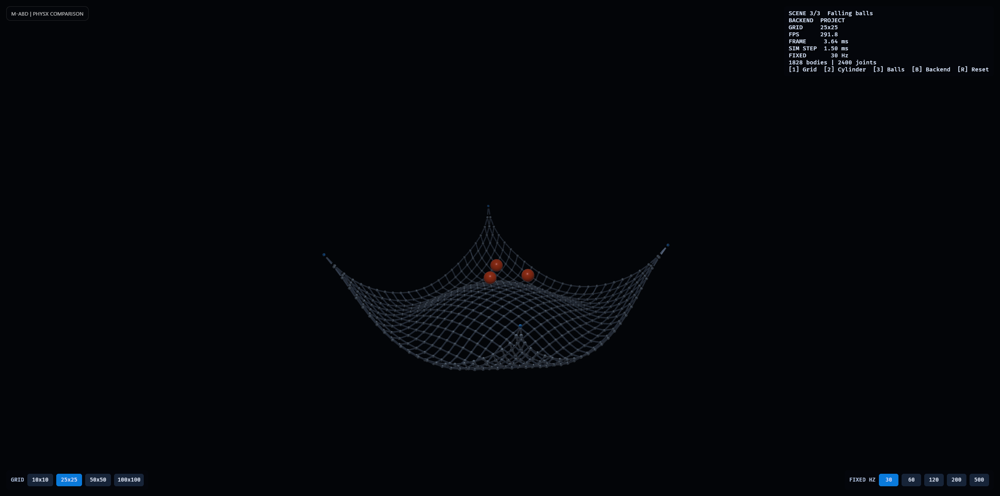

# M-ABD and PhysX comparison

A focused proof-of-concept implementation of the ball-joint nets from
*M-ABD: Scalable, Efficient, and Robust Multi-Affine-Body Dynamics*.



The application has three scenes that can be changed at runtime. Each scene can
run the project's M-ABD-inspired solver or, when the PhysX backend is enabled,
an independently constructed PhysX version. Changing the scene, changing the
backend, or resetting rebuilds the selected simulation from its initial state:

- `1`: the original edge-pinned 10x10 joint grid
- `2`: the edge-pinned joint grid draped over a static cylinder
- `3`: a horizontal, four-corner-pinned joint grid catching three falling balls
- `B`: switch between the project solver and PhysX (when available)
- `R`: reset the current scene
- `10x10`, `25x25`, `50x50`, and `100x100` buttons: rebuild the current
  scene/backend with that grid size
- `30`, `60`, `120`, `200`, and `500` Hz buttons: change the fixed simulation
  rate without resetting the scene

The default 10x10 net contains the paper's inferred 280-body topology:

- 100 affine hub bodies arranged in a 10x10 grid
- 180 affine rod bodies joining horizontal and vertical neighbors
- 360 ball joints, or 1,080 scalar positional constraints
- either one fixed edge (10 hubs at the default size) or four fixed corner hubs

For an `N x N` grid, the same topology scales to `3N² - 2N` bodies and
`4N(N - 1)` ball joints. Grid-size changes preserve the existing per-cell
spacing, resize the cylinder scene to span the wider net, reframe the camera,
and reset the simulation.

Each affine body is represented by the four control points from Section 4.1.
Each fixed step performs an implicit prediction and a compact co-rotated
local/global solve. The ball-joint system is solved exactly in independent hub
blocks by exploiting the orthogonal rod-end attachments and shared hub-center
attachments, rather than iterating over a generic constraint matrix. Primitive
sphere/capsule contacts provide two-way interaction with the cylinder and
falling balls. The default timestep is the Figure 12 value of `1/30 s`; the
on-screen controls can change it up to `1/500 s` at runtime. A compact overlay
reports the active scene, smoothed FPS and frame time, measured simulation-step
duration, fixed rate, grid dimensions, and scene size.

The PhysX versions manually recreate all three setups with rigid sphere and box
actors connected by spherical joints, plus a static capsule for the cylinder
scene and rigid spheres for the falling-ball scene. There is no live state
transfer or shared physics-scene format between the backends. Bevy owns the
window, rendering, input, scene switching, and overlay; the active backend owns
the simulation state. Native builds use the `physx` Rust wrapper (PhysX 5.1.3),
while browser builds use the `physx-js-webidl` WebAssembly package (PhysX
5.6.1).

## Run natively

The default native build includes only the project solver. This is the fast
development configuration and avoids compiling the PhysX C++ SDK:

```sh
cargo run
```

Enable the native PhysX comparison explicitly when it is needed:

```sh
cargo run --features native-physx
```

The first PhysX-enabled build requires a C++ toolchain. On Windows, use the
MSVC Rust toolchain with Visual Studio Build Tools and the **Desktop development
with C++** workload.

## Compare simulation step time

The three opt-in performance tests exercise the same project-solver `step`
work measured by the on-screen `SIM STEP` value. By default each test uses a
fresh 10x10 scene, advances 20 untimed warm-up steps so contacts are active,
and reports the median milliseconds per step from seven short batches. Run all
three with:

```sh
cargo bench-scenes
```

Set `STEP_TIME_GRID_SIZE` to benchmark a larger grid. The harness automatically
uses fewer samples as the grid grows, keeping even the 100x100 check short:

```powershell
$env:STEP_TIME_GRID_SIZE = 100
cargo bench-scenes
```

```sh
STEP_TIME_GRID_SIZE=100 cargo bench-scenes
```

Filter to one scene when needed, for example:

```sh
cargo test --no-default-features step_time_scene_2 -- --ignored --nocapture --test-threads=1
```

The run is intentionally short and serial. It does not compile or link PhysX,
and it prints one machine-readable `STEP_TIME` line for each scene. To save a
baseline before changing the solver and compare against it afterward on
Windows:

```powershell
.\scripts\compare-step-times.cmd -SaveBaseline
# Make the optimization, then compare all three scenes.
.\scripts\compare-step-times.cmd
```

Pass `-GridSize 25`, `50`, or `100` to save and compare a size-specific
baseline. Each size gets its own default baseline file:

```powershell
.\scripts\compare-step-times.cmd -GridSize 100 -SaveBaseline
.\scripts\compare-step-times.cmd -GridSize 100
```

Negative percentages in the comparison are faster. Changes inside the default
two-percent noise threshold are labeled `WITHIN NOISE`; the threshold can be
changed with `-NoiseThresholdPercent`. Use the same machine, power mode, and
background workload for both runs, and repeat small changes. The generated
baseline file is local and ignored by Git.

## Run in a browser

Install the one-time prerequisites if needed:

```sh
rustup target add wasm32-unknown-unknown
cargo install --locked trunk
npm install
```

Start the development server:

```sh
npm run serve -- --open
```

The site is available at <http://127.0.0.1:8080> if it does not open
automatically. For a quick optimized browser build while iterating, use:

```sh
npm run build:fast
```

This still uses Cargo's optimized `release` profile, but skips Trunk's slow
whole-module `wasm-opt` post-processing. Create the smaller, fully processed
deployable bundle when needed with:

```sh
npm run build
```

For final native runtime comparisons, Cargo also provides the more expensive
fat-LTO profile explicitly:

```sh
cargo build --profile max-performance --no-default-features
```

## MVP scope

This demo includes co-rotated affine bodies, fixed-step implicit prediction,
linear ball joints, a dual constraint solve, and deliberately narrow analytic
contacts for spheres, rod capsules, and one static cylinder. It intentionally
omits friction, restitution, continuous collision detection, self-collision,
arbitrary mesh collision, other joint types, interactive manipulation, GPU
compute, and the paper's million-body solver optimizations. The PhysX versions
are deliberately narrow equivalents of these three demos, not a general
scene-conversion layer.
